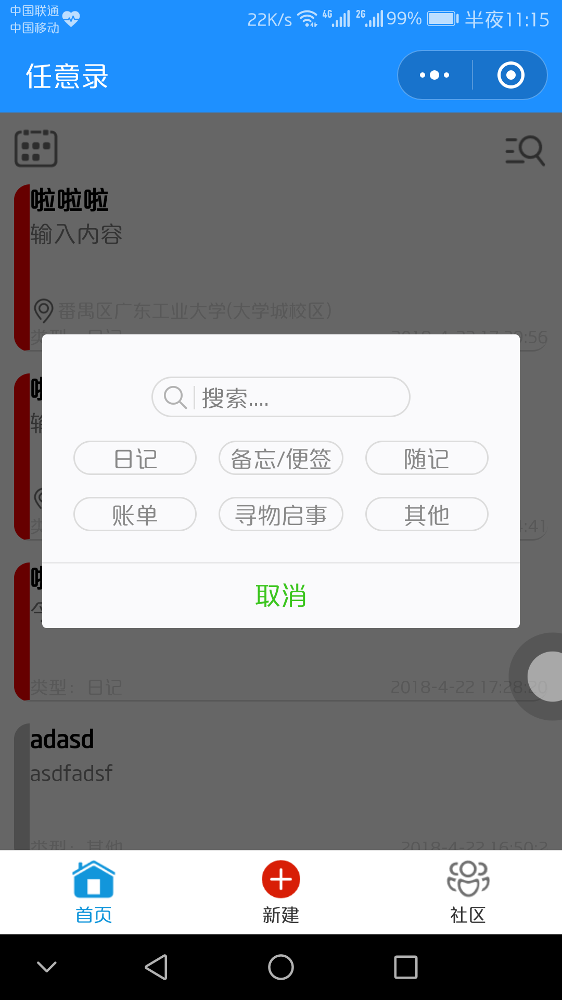
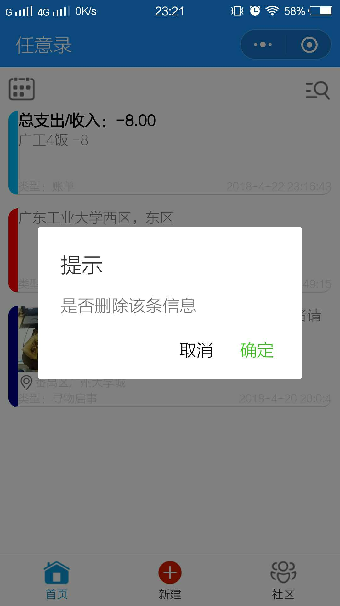
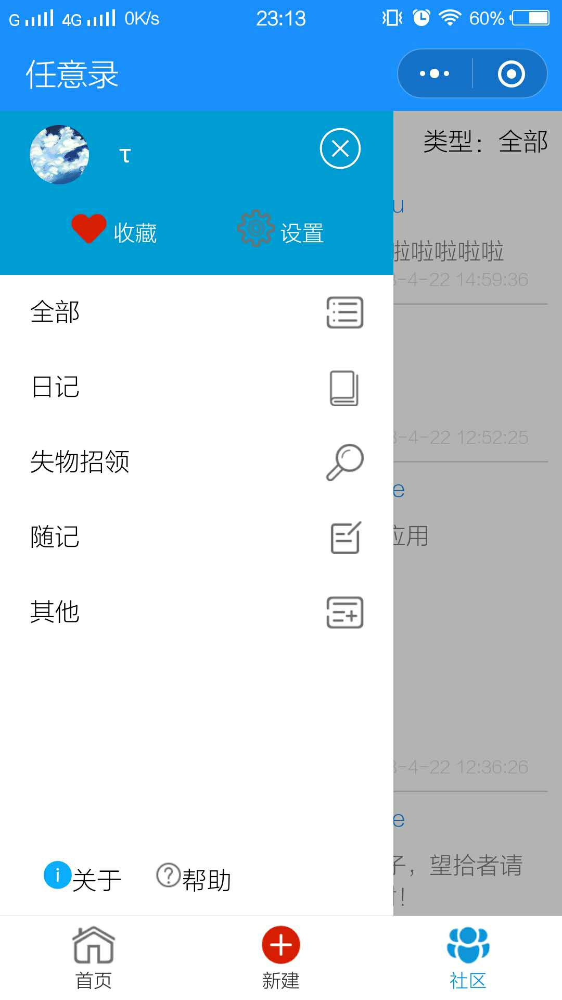
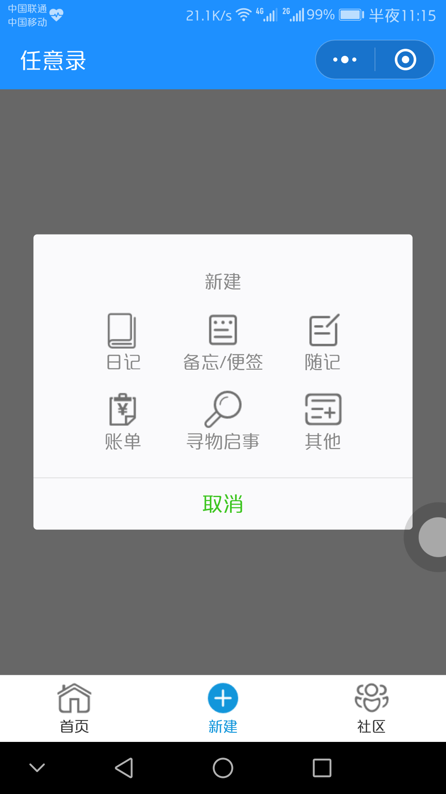
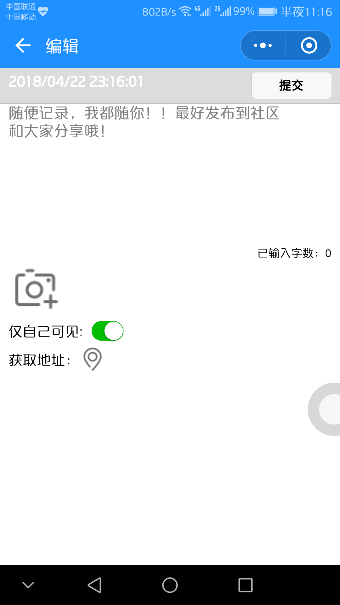
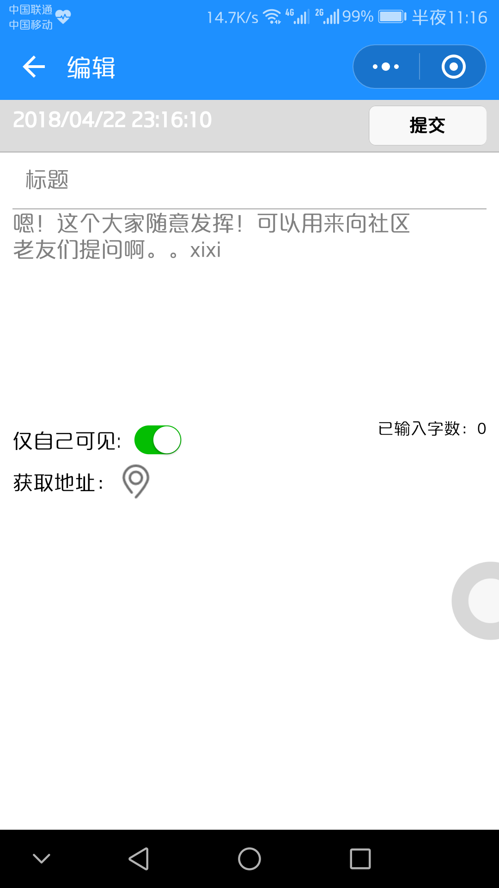
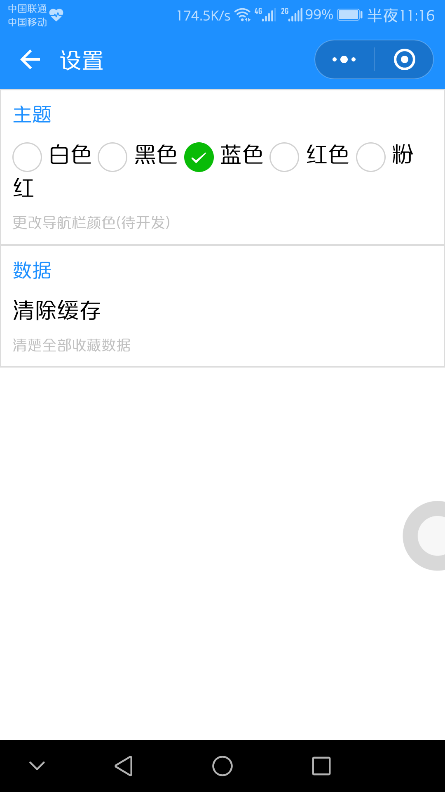

# 功能描述

- 日记
- 备忘录/便签
- 失物招领
- 账单
- 收藏内容
- 内容回复

# 项目结构简介
### **主页（../../home）**
示图1 | 示图2 | 示图3
------------- | -------------|------------
 |  | 

- 主界面显示本人所新建内容，包括：日记（红）、备忘/便签（橙）、随记（绿）、账单（蓝）、寻物启事（深蓝）、其他（灰）
- 长按项目出现“删除”提示框
- 点击各项目进去详情页
- 点击主页左上角“日历”图标可选择日期，查看特定日期的内容
- 点击主页右上角“查询”图标显示查询框

### **社区（../../index）**
示图1 | 示图2
------------- | -------------
 | 

- 社区显示个用户发布的内容以及所有的寻物启事
- 社区界面上方设有搜索框
- 点击对应的内容可进入详情页
- 点击左上角图标显示侧栏
- 侧栏点击对应项可以查看相关内容

### **新建（../../new && ../../edit）**
示图1 | 示图2 | 示图3 | 示图4
------------- | -------------|------------ |-------------
 |  | |
示图5 | 示图6 | 示图7
 || 

- 新建主页点击相应图标进入相应的编辑页
- 日记、随记、其他有“仅自己可见”选项，默认“是”，备忘录、账单仅限自己可见，寻物启事均发布到社区中
- 日记选择图片最多一张，其他最多9张
- 各板块均无字数限制

### **详情（../../read）**
示图1 | 示图2
------------- | -------------
 | 

- 社区详情页支持回复和收藏功能
- 收藏功能会实时收藏在收藏页，点击可收藏或取消收藏
- 本人所发送的回复消息可供删除
- 主页详情页显示项目的全部内容，右上角点击可出现编辑和删除选项

### **设置（../../setting）**

- 目前设置页只有数据项生效
- 点击数据项会将收藏类目全部清除
- 主题选项点击会更改导航栏颜色（目前只实现当页颜色更改）

### **收藏（../../like）**

- 显示所有收藏的内容

# 开发相关

- 开发环境：Windows 10
- 开发软件：微信web开发工具（v1.02.1803210）

# 关于

- 小程序名称：任意录
- 版本号： 1.0.018.4
- 开发团队：AE86
- 联系邮箱：tidraper@qq.com
